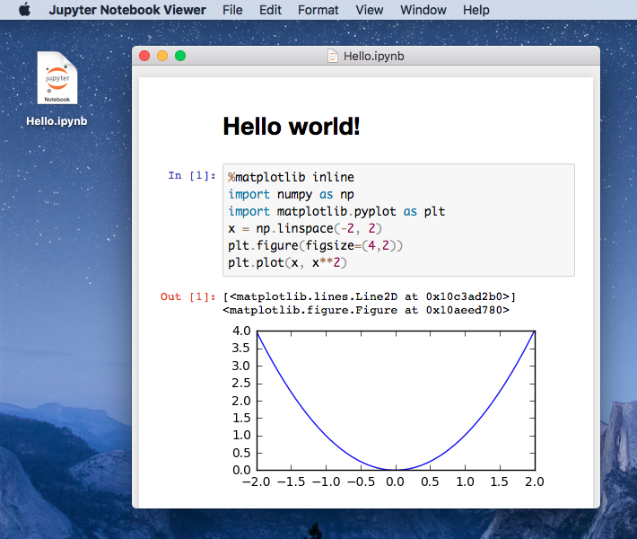

# Jupyter Notebook Viewer

A native macOS application to view
[Jupyter](https://jupyter.org/)/[IPython](https://ipython.org/) notebooks.

## Features

- Stand-alone, thanks to [nbviewer.js](https://github.com/kokes/nbviewer.js)
- Integrated [Quick Look generator](https://github.com/tuxu/ipynb-quicklook/)
- Nice icons 😎

## Getting started

- Download `nbviewer-app.zip`
  ([Releases](https://github.com/tuxu/nbviewer-app/releases))
- Unzip and move `Jupyter Notebook Viewer.app` to `/Applications` and enjoy 👍
- Quick Look should work out of the box. If it doesn't, check
  `qlmanage -m plugins | grep ipynb` to see whether the plugin appears there.

## Screenshot

## Acknowledgments

- Ondrej Kokes for [nbviewer.js](https://github.com/kokes/nbviewer.js)

## License

This project is licensed under the MIT license. See [LICENSE.md](LICENSE.md) for
details.

© 2017 [Tino Wagner](http://www.tinowagner.com/)
